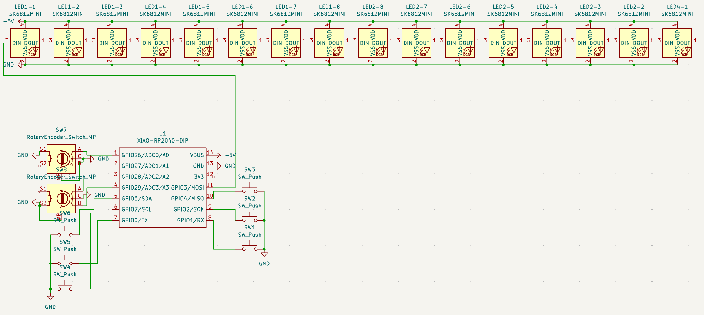
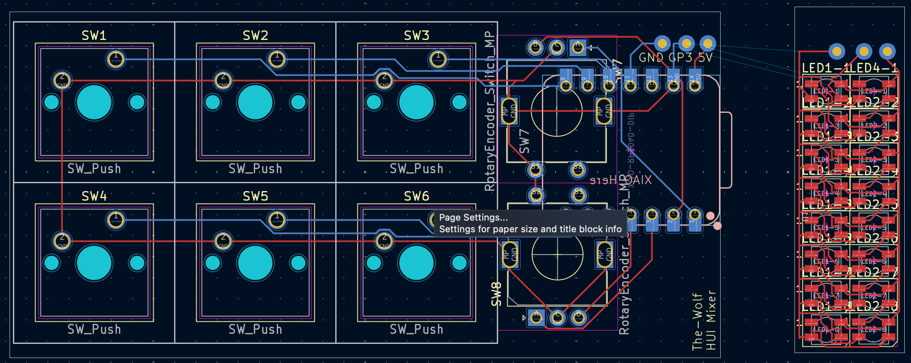
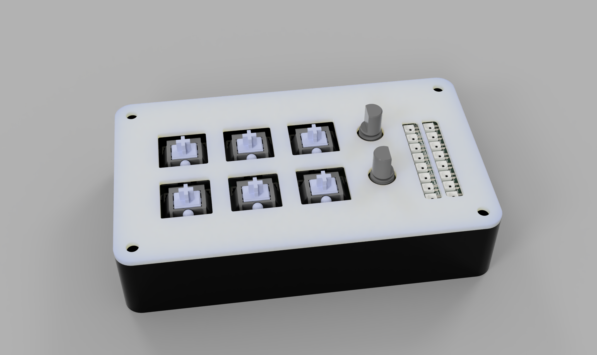

# HUI Mixer
A versatile HUI device for mixing in any DAW that supports peripherals (Logic Pro, Pro Tools, CuBase).

Schematic:

PCB:

Assembled:

## BOM
| Part | Quantity |
| --- | --- |
| EC11 Rotary Encoder | 2 |
| MX-Style Switch | 6 |
| SK6812 MINI-E LED | 16 |
| M3x16mm Screw | 4 |
